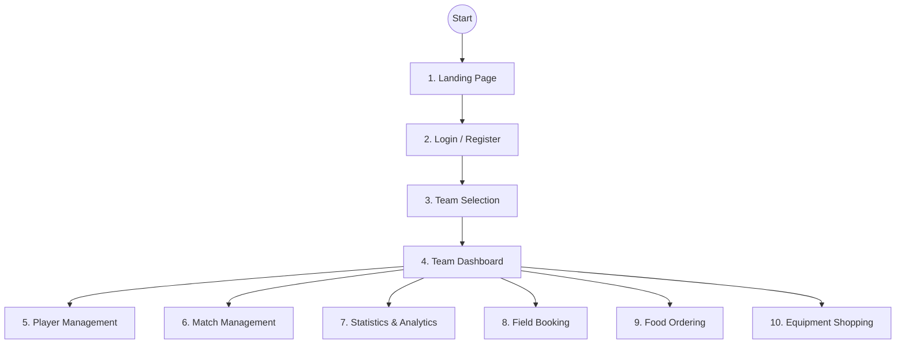

# User Journey & Flow

## 🗺️ User Journey Map

## 🛤️ Detailed Journeys

### Journey 1: First Time User (Role-based Onboarding)

1. **Visit**: User visits `phuide.com` -> Sees Landing Page.
2. **Action**: Clicks "Start Now" -> Register Form.
3. **Auth**: Registers (Email/Google) -> Verifies Email.
4. **Role Selection**: User chooses account type (`PLAYER`, `FIELD_OWNER`, `VENDOR`).
5. **Role-specific Onboarding**:
   - **PLAYER (Player/Team Manager)**: Nhập thông tin cá nhân cơ bản -> Redirected to `/teams` (Empty State). Có thể chọn tạo đội ngay ("Create New Team").
   - **FIELD_OWNER (Chủ sân)**: Nhập SĐT, thông tin cơ bản của sân bóng -> Chờ xác minh (Verification: `PENDING`) -> Redirect to `/owner/dashboard`.
   - **VENDOR (Chủ Shop/Quán ăn)**: Nhập SĐT, thông tin cửa hàng -> Chờ xác minh -> Redirect to `/vendor/dashboard`.
6. **Success**: User completes onboarding -> `onboarding_completed = true` -> Goes to respective Dashboard.

### Journey 2: Returning User (Manager)

1. **Login**: Logs in at `/login`.
2. **Selection**: Sees list of managed teams at `/teams`.
3. **Access**: Clicks "Passion FC" card -> Enters `/teams/passion/dashboard`.
4. **Overview**: Checks quick stats (Players, Matches, Win Rate).
5. **Action**:
   - Manage Roster (Players)
   - Record Match Result (Matches)
   - View Analytics (Stats)
   - Book Field for next game (Fields)
   - Order Food (Services)
